# Architecture

The current development preview uses a WordPress-independent PHP domain and application layer. All WordPress hooks and storage dependencies live in adapters/infrastructure. Runtime class loading uses PSR-4 without shipping Composer vendor dependencies. The intended target is PHP 8.2+ with intl, mbstring and dom, WordPress 6.8+; tested versions are recorded in TESTING.md.

```mermaid
flowchart LR
  A[WordPress adapter or typed API] --> B[ContentPayload and ModerationContext]
  B --> C[Normalize each field once]
  C --> D[Indexed deterministic detection]
  D --> E[Bounded evidence and score]
  E --> F[Nested policy predicates]
  F --> G[Review-first decision]
  G --> H[Metadata-only audit]
  H --> I[WordPress status enforcement]
```

ContentField/ContentPayload/Actor/ModerationContext and ModerationRequest are immutable. Original text is separate from NormalizedContent. ContentField explicitly selects text or HTML; only HTML fields strip markup. Encoded tags remain visible literal analysis text because entity decoding follows extraction. Evidence offsets refer to normalized bytes, never original HTML positions. Detectors cannot change WordPress data. Moderator returns a result; ContentAdapter separately changes status.

Aho–Corasick uses sparse byte transitions, BFS failure links and suffix output links. Word boundaries inspect complete Unicode codepoints. Normalized dictionary text is capped at 2 MiB and compiled index growth at 200,000 states, with periodic memory-limit headroom checks during compilation. Candidate output is capped at 4,096 matches and evidence at 128 per field. Truncation forces review. Lossy evasion signals carry an engineering confidence of 0.7, not an empirically calibrated probability. All destructive actions are downgraded to pending in this preview.

Policies contain validated nested AND/OR/NOT conditions. Unknown signals propagate as unknown, including under NOT, and do not match. Enabled rules sort by descending priority, then lexical ID. First matching rule wins. No match allows content. Severity does not directly select enforcement. Only the current supported fact vocabulary is accepted; reputation and account-age facts may be supplied by trusted typed API callers, but reputation infrastructure is outstanding.

PolicyStore caches a policy/compiled engine per request and site prefix. Optional WordPress object caching uses a key containing engine format, site table prefix, policy version and snapshot checksum. Without a persistent object cache, each new request recompiles on first use. A fresh request reads the active snapshot; policy changes within an already executing request may finish using the prior snapshot. This consistency choice is explicit.

Implemented directories: Domain/{Content,Detection,Moderation,Policy}, Application/Services, Infrastructure/Database, Integrations/WordPress, Admin/{REST,Screens}, Privacy. Other requested modules have not been scaffolded as empty promises. No AI, queue, media, cloud, third-party integration or full workflow implementation exists yet.

Official hook references: [post data filter](https://developer.wordpress.org/reference/hooks/wp_insert_post_data/), [comment approval](https://developer.wordpress.org/reference/hooks/pre_comment_approved/), [comment update](https://developer.wordpress.org/reference/hooks/wp_update_comment_data/), [low-level comment insertion](https://developer.wordpress.org/reference/functions/wp_insert_comment/).

Submission coordination uses application PolicyProvider/AuditJournal contracts. Metadata-only AuditEvent attempts become committed decisions only after WordPress acknowledgement. See ADR 0004 and REVIEW-FIXES.md for correlation and failure limits.
